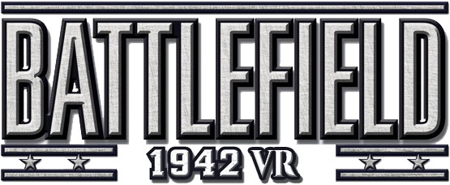

# BFVR

BFVR adds stereoscopic VR rendering, tracked-controller aiming, VR menus, and
VR comfort and graphics options to Battlefield 1942.

The normal player version is launched by double-clicking `BFVR.exe`. It does
not need a batch file and it does not replace `BF1942.exe`. BF42++ is a
separate prerequisite which the player installs in the main game directory.

## Requirements

- A working, legally installed copy of Battlefield 1942 on 64-bit Windows 10
  or Windows 11.
- A PC VR headset and an active OpenXR runtime, such as Meta Quest Link or
  SteamVR.
- A Battlefield 1942 installation containing `BF1942.exe`.
- [BF42++ 2.0 RC6](https://www.moddb.com/games/battlefield-1942/addons/bf42plusplus-v2-0-rc6)
  or a newer compatible release, extracted beside `BF1942.exe` with its
  original filenames. BF42++ is not included with BFVR.

Battlefield 1942 has several retail, digital, and community-modified
executables. BFVR does not block unfamiliar executables. A different build may
still be incompatible because some BFVR features connect to internal game
code, so compatibility is being established through real testing.

## Installing and playing

See [Installation](docs/INSTALLATION.md) for a beginner-friendly walkthrough.
After installation:

1. Connect the headset and start the OpenXR software you normally use.
2. Double-click the BFVR shortcut or `Battlefield 1942\BFVR\BFVR.exe`.
3. Choose a map using Battlefield 1942's normal menus.
4. Exit Battlefield 1942 normally when finished.

See the [User Guide](docs/USER_GUIDE.md) for controls, settings, SteamVR setup,
troubleshooting, and uninstalling.

## Important safety information

BFVR loads its own DLL into the Battlefield 1942 process. That is how this mod
connects VR rendering and controls to an old game that has no mod API for these
features. Antivirus software may treat that technique cautiously.

The v1.0.0 installer is intentionally unsigned, so Windows may display
"Unknown publisher." Only run an installer downloaded from this repository's
official GitHub Release page, and compare its published SHA-256 checksum when
in doubt.

BFVR does not bypass anti-cheat or server rules. Use it only where client-side
mods are permitted.

## Source and development

The source code, third-party source, tests, and developer diagnostics live in
this repository. They are not copied into the player installation. See
[Development](docs/DEVELOPMENT.md) and the detailed [development record](devREADME.md).

Third-party components and their licenses are listed in
[Third-Party Notices](THIRD_PARTY_NOTICES.md).

BFVR source is available under the [MIT License](LICENSE).
